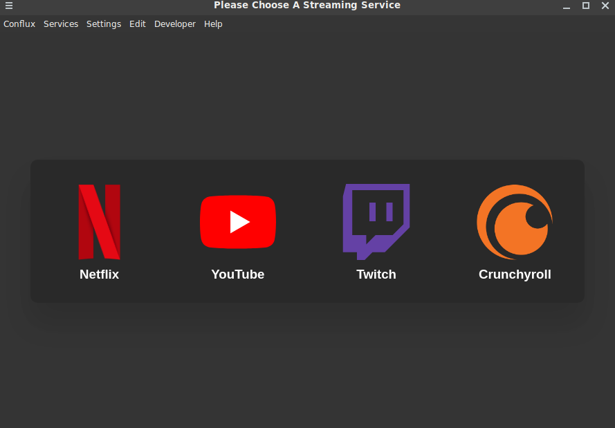

# Conflux

[](https://github.com/OOF2510/Conflux/actions/workflows/build.yml)

An Electron Based Web Video Services Player. Supporting Netflix, Youtube, Twitch, Floatplane, Hulu, Amazon Prime Video And More.



_The app's main menu_

## Features

- Multiple Streaming Services Support (JSON Configuration to add extra)
- Adblock
- BTTV
- Always On Top Window
- Set Startup Page (Any Service or Remember Last Opended Page)
- Frameless Window
- Rough Mac Picture in Picture Support (Floating Window, Above All Desktop and Fullscreen Applications)
- Full Screen Window on Startup

## Installation

Download and install the respective build for your OS from the [releases](https://github.com/oof2510/Conflux/releases) page, the most recent successful build artifact from the [Actions](https://github.com/oof2510/Conflux/actions) tab, or build yourself.

## Building
```bash
git clone https://github.com/oof2510/Conflux.git
cd Conflux/
yarn install
yarn build
```

## Developing

```bash
git clone https://github.com/oof2510/Conflux.git
cd Conflux/
yarn install
yarn start
```

## Contirbutors
This repo is a fork of [oscartbeaumont's ElectronPlayer](https://github.com/oscartbeaumont/ElectronPlayer), and would not be possible without it or the contributors to that repo that are listed below.

- [Austin Kregel](https://github.com/austinkregel)
- [Rasmus Lindroth](https://github.com/RasmusLindroth)
- [Scrumplex](https://github.com/Scrumplex)
